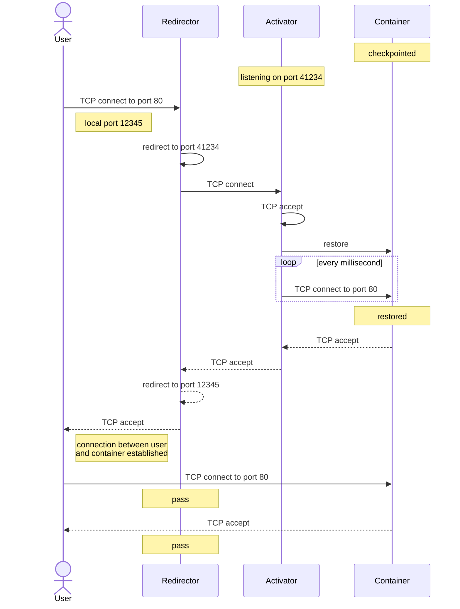

# zeropod - pod that scales down to zero

Zeropod is a Kubernetes runtime (or more specifically a containerd shim) that
automatically checkpoints containers to disk after a certain amount of time of
the last TCP connection. While in scaled down state, it will listen on the same
port the application inside the container was listening on and will restore the
container on the first incoming connection. Depending on the memory size of the
checkpointed program this happens in tens to a few hundred milliseconds,
virtually unnoticeable to the user. As all the memory contents are stored to
disk during checkpointing, all state of the application is restored. [It adjusts
resource requests](#in-place-resource-scaling) in scaled down state in-place if
the cluster supports it. To prevent huge resource usage spikes when draining a
node, scaled down pods can be [migrated between nodes](#zeropodctroxdevmigrate)
without needing to start up. There is also a more experimental [live migration
feature](./docs/experimental/migration.md#live-migration) that stretches the
scaling use cases of zeropod.

## Use cases

* Low traffic sites
* Dev/Staging environments
* Providing a small tier on Heroku-like platforms
* "Mostly static" sites that still need some server component

## How it works

First off, what is this containerd shim? The shim sits between containerd and
the container sandbox. Each pod has such a long-running process that calls out
to runc to manage the lifecycle of all containers of a pod.

show containerd architecture

There are several components that make zeropod work but here are the most
important ones:

* Checkpointing is done using [CRIU](https://github.com/checkpoint-restore/criu).
* After checkpointing, a userspace TCP proxy (activator) is created on a
  random port and an eBPF program is loaded to redirect packets destined to
  the checkpointed container to the activator. The activator then accepts the
  connection, restores the process, signals to disable the eBPF redirect and
  then proxies the initial request(s) to the restored application. See
  [activation sequence](#activation-sequence) for more details.
* All subsequent connections go directly to the application without any
  proxying and performance impact.
* An eBPF probe is used to track the last TCP activity on the running
  application. This helps zeropod delay checkpointing if there is recent
  activity. This avoids too much flapping on a service that is frequently
  used.
* To the container runtime (e.g. Kubernetes), the container appears to be
  running even though the process is technically not. This is required to
  prevent the runtime from trying to restart the container.
* When running `kubectl exec` on to the scaled down container, it will be
  restored and the exec should work just as with any normal Kubernetes
  container.
* Metrics are recorded continuously within each shim and the zeropod-manager
  process that runs once per node (DaemonSet) is responsible to collect and
  merge all metrics from the different shim processes. The shim exposes a unix
  socket for the manager to connect. The manager exposes the merged metrics on
  an HTTP endpoint.

### Activation sequence

This diagram shows what happens when a user initiates a connection to a
checkpointed container.

show diagram

## Compatibility

Most programs should to just work with zeropod out of the box. The
[examples](./config/examples) directory contains a variety of software that have been
tested successfully. If something fails, the containerd logs can prove useful
to figuring out what went wrong as it will output the CRIU log on
checkpoint/restore failure. What has proven somewhat flaky sometimes are some
arm64 workloads running in a linux VM on top of Mac OS. If you run into any
issues with your software, please don't hesitate to create an issue.

## Docs

For more resources and documentation, head to the [docs](./docs/README.md).
