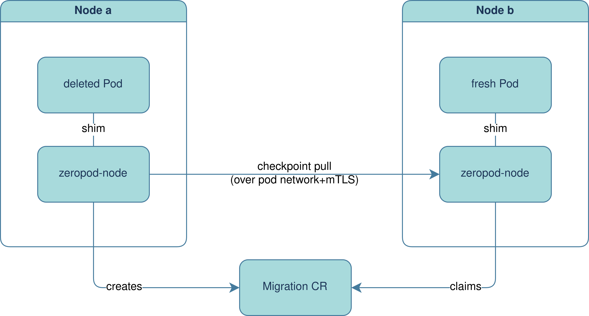
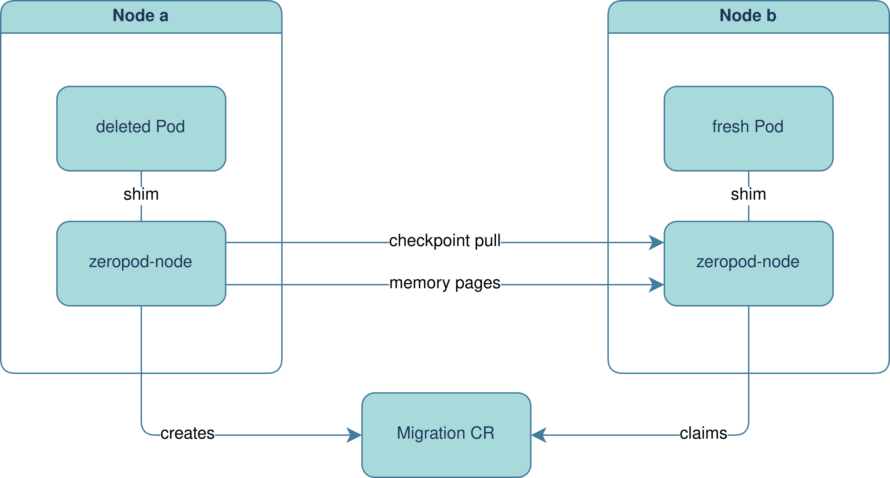

# Pod Migration (Experimental)

## Offline Migration

```yaml
zeropod.ctrox.dev/migrate: "nginx,sidecar"
```

Enables migration of scaled down containers by listing the containers to be
migrated. When such an annotated pod is deleted and it's part of a `Deployment`,
the new pod will fetch the checkpoints of these containers and instead of
starting it will simply wait for activation again. This minmizes the surge in
resources if for example a whole node of scaled down zeropods is drained.

<details><summary>show offline migration diagram</summary>



</details>

## Live Migration

```yaml
zeropod.ctrox.dev/live-migrate: "nginx"
```

Enables live migration of a running container in the pod. Only one container per
pod is supported at this point. When such an annotated pod is deleted and it's
part of a `Deployment`, the new pod will do a lazy-migration of the memory
contents. This requires
[userfaultd](https://www.kernel.org/doc/html/latest/admin-guide/mm/userfaultfd.html)
to be enabled in the host kernel (`CONFIG_USERFAULTFD`).

<details><summary>show live migration diagram</summary>



</details>

## Disable Migration of Container Data

```yaml
zeropod.ctrox.dev/disable-migrate-data: "true"
```

When migrating a pod (regardless of live or scaled down), data that has been
written to the containers file system will be copied over. This is done by
copying the upper layer of the container overlayfs. Enabled by default but can
be disabled with this annotation.
